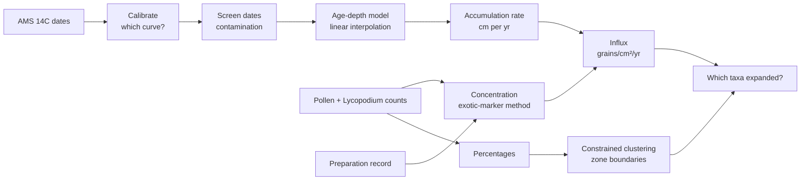

# Congo Peat Pollen

**A research-grade evaluation task for AI agents: calibrate, screen, model and interpret a tropical peat core, end to end.**

[](https://github.com/mnkyalo/ai-eval-task-congo-peat-pollen/actions/workflows/validate.yml)


This repository contains a complete scientific-computing task written in the [Harbor](https://www.harborframework.com/docs/tasks) format, the framework behind Terminal-Bench. An AI agent is dropped into a Docker container holding the full dataset of a peat core from the Cuvette Centrale in the Republic of the Congo. The dataset has 15 AMS radiocarbon dates, 70 counted pollen levels, a sample preparation record and a library of calibration curves. The agent has to turn that into calendar ages, pollen influx and a vegetation history. A separate verifier container then re-derives the answer from sealed data and scores the submission as pass or fail.

I built this as a portfolio example of how I design evaluation tasks. It covers the science, the data design, the grader, the adversarial validation and a candid post-mortem. The core and site are synthetic. The analytical workflow is the real one I learned as a palaeoecologist working on sediment cores.

---

## Contents

- [The scientific problem](#the-scientific-problem)
- [Where a solver can go wrong](#where-a-solver-can-go-wrong)
- [How it is graded](#how-it-is-graded)
- [Proof that the grader discriminates](#proof-that-the-grader-discriminates)
- [Running it](#running-it)
- [Repository layout](#repository-layout)
- [Design review: what I would change](#design-review-what-i-would-change)
- [Data provenance and licences](#data-provenance-and-licences)
- [About me](#about-me)

---

## The scientific problem

The central Congo Basin peatlands are among the largest tropical peat complexes on Earth ([Dargie et al. 2017, *Nature* 542:86–90](https://doi.org/10.1038/nature21048)). To read a vegetation history from one of their cores, a palynologist has to work through a chain of steps. Each step uses the output of the one before it:



The agent receives only the raw files and [one page of instructions](task/instruction.md). The instructions fix the reporting conventions: the calibrated median, linear interpolation, constrained clustering on percentages and a 1.5× influx rule for "expanded". Every scientific judgement is left to the agent. That includes which calibration curve applies, which dates to trust and which counts to use.

The deliverable is a single `results.json` with 79 graded fields: 15 calibrated ages, the set of excluded dates, two zone boundaries, 60 influx values (10 taxa at 6 depths) and the taxa that expanded at each boundary.

## Where a solver can go wrong

The task was designed so that its difficulty comes from the science, not from hidden information. Every trap has evidence in the data a careful expert would act on:

| # | Trap | Evidence in the data | If missed |
|---|------|----------------------|-----------|
| 1 | **Hemispheric calibration.** The site sits at 0.68° N under the twice-yearly ITCZ passage, so the peat fixed carbon from both hemispheres' air. The dates need a mixed IntCal20/SHCal20 curve. | Coordinates and the rainfall regime in `site_metadata.txt`. The library ships three curves and none is named. | IntCal20 alone moves one date 70.1 yr against a 45 yr band. |
| 2 | **Rootlet-contaminated dates.** Three bulk-peat samples carry modern root carbon. | They could not be sieved, their C:N is 33–35 against a 14.7–19.4 background, and each is younger than the date above it. | Influx values are off by up to 225%. |
| 3 | **Superseded count.** One level was counted twice. | The counting record marks the first count as abandoned. | That level's influx is 35–70% out. |
| 4 | **Variable spike.** The number of *Lycopodium* tablets and the sub-sample volume change from level to level. | `spike_and_volume.csv` | Assuming the textbook 2 tablets in 1 cm³ puts 10 influx values 50% out. |
| 5 | **Closed-sum artefact.** Percentages can rise only because another taxon collapsed. | Only absolute influx separates a true expansion from an artefact. | Reading expansions off percentages gives the wrong taxa at both boundaries. |
| 6 | **Zonation.** The boundaries are not given. | Stratigraphically constrained clustering ([Grimm 1987](https://doi.org/10.1016/0098-3004(87)90022-7)). | See the [design review](#design-review-what-i-would-change): this one does not bite. |

Grading is all-or-nothing across all 79 fields. A wrong curve or a kept bad date gives ages, rates and influx values that all *look* plausible, and the errors compound down the chain.

## How it is graded

**Tolerances are measured, not chosen.** Each band sits between the spread of honest implementations and the smallest error it has to catch:

| Field | Tolerance | Honest spread it must absorb | Error it must catch |
|---|---|---|---|
| Calibrated ages | ±45 cal yr | ≤31.1 yr (mixing 35–100% southern, grid step, σ-mixing rule, a third-party calibration engine) | 70.1 yr (IntCal20 only) |
| Influx | ±25% relative | ≤13.2% | 35–225% (spike, superseded count, contaminated dates) |
| Excluded dates, boundaries, expansions | exact set match | none; three independent signals give the same set | any difference |

**The verifier is hard to tamper with**, because every Harbor task runs agent code in a live container:

- The verifier runs in a **separate container** (`environment_mode = "separate"`). The agent's container is gone before grading starts.
- The raw data is **sealed into the verifier image**. `reference.py` re-derives the full answer at grading time, so nothing the agent writes can change what it is compared against.
- The frozen `answer_key.json` is only used as an **integrity check on the verifier itself**. If a fresh derivation stops reproducing it, the run fails loudly.
- An **internal-consistency check** recomputes every reported influx value from the submission's *own* chronology. A fabricated, hedged or hand-assembled answer cannot satisfy it.
- `test.sh` wipes `/logs/verifier` first, so a planted `reward.txt` never survives. It writes a binary reward on **every** code path, including a crashed pytest run.

## Proof that the grader discriminates

A grader is only as good as the mistakes it demonstrably catches. [`validation/run_validation.py`](validation/run_validation.py) builds the oracle, three honest variants and eight shortcut answers. Each shortcut switches **one** analytical decision away from the reference, and the last one combines them all. All of them run through the **unmodified verifier code** in `task/tests/`:

```text
submission                                 reward expect  failed checks
----------------------------------------------------------------------------------------------------
oracle (solution/solve.py)                      1      1  all 82 passed
honest: 35% southern mixture                    1      1  all 82 passed
honest: 65% southern mixture                    1      1  all 82 passed
honest: 5-yr calibration grid                   1      1  all 82 passed
wrong: IntCal20 only                            0      0  chronology 2
wrong: Marine20                                 0      0  chronology 15, consistency 1
wrong: keep rootlet-contaminated dates          0      0  excluded 1, influx 20, expansions 1, consistency 1
wrong: use superseded count at 55 cm            0      0  influx 5, consistency 1
wrong: assume 2 tablets in 1 cm3                0      0  influx 10, consistency 1
wrong: expansions from percentages              0      0  expansions 2
NOT CAUGHT: boundaries from largest jumps       1      1  all 82 passed
wrong: every shortcut at once                   0      0  chronology 2, excluded 1, influx 35, expansions 2, consistency 1
----------------------------------------------------------------------------------------------------
ALL EXPECTATIONS MET
```

Each wrong answer fails in the section its mistake belongs to and passes the rest. That is what makes a failure diagnosable. One row is labelled **NOT CAUGHT** on purpose. A naive "two largest jumps" zonation finds the same boundaries as constrained clustering, so trap 6 does not discriminate. The harness asserts that fact rather than hiding it. The same script runs in [CI](.github/workflows/validate.yml) on every push.

## Running it

### 1. Quick check, no Docker (needs only Python and numpy)

```bash
git clone https://github.com/mnkyalo/congo-peat-pollen.git
cd congo-peat-pollen
pip install numpy
python3 validation/run_validation.py
```

### 2. Full Harbor run (needs Docker)

```bash
pip install harbor                                     # or: uv tool install harbor

harbor tasks check task                                # static checks on the task package
harbor run -p task -a oracle                           # oracle should score 1.0
harbor run -p task -a <agent> -m <provider/model>      # evaluate an agent
```

Harbor builds `task/environment/Dockerfile` for the agent and `task/tests/Dockerfile` for the verifier. It runs the agent with a 3-hour budget, tears that container down, then runs `tests/test.sh` in the verifier container and reads `/logs/verifier/reward.txt`.

### 3. The two images by hand

```bash
docker build -t cpp-env   task/environment
docker build -t cpp-tests task/tests

# run the oracle inside the agent image
docker run --rm -v "$PWD/task/solution:/solution:ro" -v "$PWD/out:/app/out" cpp-env \
  sh -c "bash /solution/solve.sh && cp /app/results.json /app/out/"

# grade that output inside the verifier image
docker run --rm -v "$PWD/out/results.json:/app/results.json:ro" cpp-tests \
  sh -c "bash /tests/test.sh; cat /logs/verifier/reward.txt"
```

## Repository layout

```text
task/                          # the Harbor task package, exactly as Harbor consumes it
├── task.toml                  # metadata, difficulty / solution / verification explanations, resources
├── instruction.md             # the only text the agent is given
├── environment/
│   ├── Dockerfile             # agent image: python 3.11 + numpy, data copied to /app/data
│   └── data/                  # dates, counts, preparation record, site metadata, 14C curves
├── solution/
│   ├── solve.sh               # oracle entry point
│   └── solve.py               # reference derivation, reads only solver-visible files
└── tests/
    ├── Dockerfile             # verifier image: pytest + numpy, sealed data baked in
    ├── test.sh                # wipes /logs, runs pytest, writes a binary reward on every path
    ├── test_outputs.py        # 82 checks: integrity, schema, 79 fields, internal consistency
    ├── grading_lib.py         # tolerances, with the measured spread behind each one
    ├── reference.py           # grading-time re-derivation
    ├── answer_key.json        # frozen key, used only as a verifier integrity check
    └── data/                  # sealed copy of the raw data
validation/
├── run_validation.py          # oracle, honest variants and wrong answers through the real verifier
├── variants.py                # one-decision-at-a-time solver used to build them
└── expected_output.txt
docs/
└── design-notes.md            # design rationale and post-mortem
```

## Design review: what I would change

This task was retired in my own pre-submission review, and the reasons teach more than the task does. The full write-up with measurements is in [`docs/design-notes.md`](docs/design-notes.md). In short:

- **The evidence announces the correction.** Phrases like "insufficient material to sieve" and "superseded by", plus a column of per-level tablet counts, exist *only* so that the solver can make the correction. A strong model reads the documentation and writes the full plan before touching any data. Good traps need evidence that has a second, genuine reason to be in the dataset.
- **Two traps are thinner than they look.** IntCal20-only fails on just 2 of 15 ages. SHCal20-only (31.1 yr) passes. The zonation trap does not bite at all.
- **The contaminated dates announce themselves.** Age reversals make a linear age-depth model impossible, so any solver is forced to deal with them.

The lesson I took forward is that difficulty has to come from a mechanism that leaves **no visible pattern** in a first-pass look at the data. Adding more checklist steps does not make a task hard. My later tasks were built on that principle, and two of them have since cleared independent difficulty review.

## Data provenance and licences

- **Core data is fully synthetic.** There is no Mbeko peatland and no core MBK-2. Every date, count and preparation record was produced by a seeded generator whose accumulation rates, pollen sums, spike sizes and noise were modelled on published central Congo Basin peat records. The laboratory codes are invented, and no real core or dataset is reproduced. The generator is not included in this repository.
- **Calibration curves are real and redistributed unmodified.** IntCal20 ([Reimer et al. 2020](https://doi.org/10.1017/RDC.2020.41)), SHCal20 ([Hogg et al. 2020](https://doi.org/10.1017/RDC.2020.59)) and Marine20 ([Heaton et al. 2020](https://doi.org/10.1017/RDC.2020.68)), all in *Radiocarbon* 62. Please cite the originals if you use them.
- **Methods referenced:** exotic-marker concentration (Stockmarr 1971, *Pollen et Spores* 13:615–621), CONISS constrained clustering ([Grimm 1987](https://doi.org/10.1016/0098-3004(87)90022-7)).
- **Code** is released under the [MIT License](LICENSE). The synthetic dataset is released under CC BY 4.0.

## About me

**Margaret Kyalo** is an aquatic ecologist and palaeoecologist (MSc Hydrobiology, University of Nairobi; PhD (Cand.) research in sedimentary ancient DNA, University of Potsdam). She has worked as an AI evaluation specialist since 2018, designing research-grade benchmark tasks, grading schemes and adversarial red-team probes for model outputs.

- First author, [Kyalo-Omamo et al. 2023, *Freshwater Biology* 68:1894–1916](https://doi.org/10.1111/fwb.14093), on sedaDNA of rotifers and 200 years of climate change in two Kenyan crater lakes
- GitHub: [@mnkyalo](https://github.com/mnkyalo)
<!-- LinkedIn: add URL here -->
